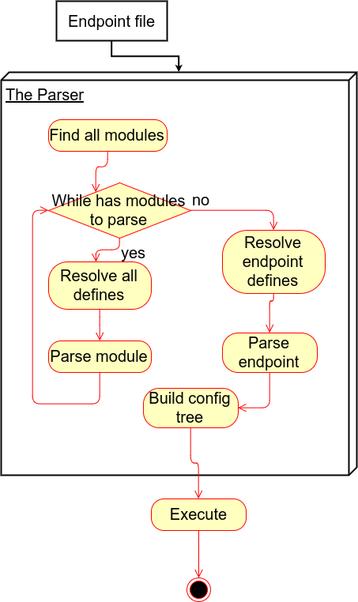

# AWS configuration language
There are 2 types of configurations: endpoint configuration and module configuration. 
Endpoint configuration can be parsed and executed. It can't have module definitions. 
Module configuration can't be executed without endpoint configuration. It can only contains 1 config module definition
## Specification
All configuration types have this format:
```
Parser-Instructions
//New line required!
Code 
```
Where `Parser-Instructions` are parser and linker instructions and `Code` is configuration/module definition
## `Parser-Instructions`
All instructions have global scope
### `#include <file>`
This instruction make linker link `file` as a plugin. All parser instructions from `file` will be parsed as well
### `#define 'REGEX' 'REPL'`
This instructions create replace rule. `REGEX` is replace regex and `REPL` is replacement. Groups can be accessed via `$index` syntax.
This instruction is useful to create constants.
`REGEX` is also function unique ID. Two or move `#define` instructions with same ID will produce an parser error
### `#ifdef ID`
Parser will parse next instructions block(to `#endif`) if `ID` is defined 
### `#ifndef ID`
Parser will parse next instructions block(to `#endif`) if `ID` is not defined
### `#endif`
End of `#ifdef`/`#ifndef` block
### Default `#define`s
This `#define` IDs will be defined by the parser if it's condition will be true

| ID | Condition |
|:--------:|:-------------:|
| WIN | Defined when current OS is Windows |
| LINUX | Defined when current OS is Linux | 
| MAC | Defined when current OS is MacOS |
| BIT_32 | Defined when current OS is 32 bit |
| BIT_64 | Defined when current OS is 64 bit |
| UNIX | Defined when current OS is UNIX-like OS | 
| FILE_ENCODING | Defines current file encoding name |
| JAVA_HOME | Defines current java home |
| USER_HOME | Defines current user home |
| USER_NAME | Defines current user name |
### DefineExtension API
All DefineProviders are loaded from core modules ONLY!
This API allows you to create your own `#define` rule: 
```java
public class HelloWorldDefineProvider implements DefineProvider {
    public String getName() {
        return "hello-world";
    }
    
    public String getDefinition(@Nonnull DefineEnvironment environment) {
        return "hi";
    }
}
```
This code creates `hello-world` define rule with `hi` definition

## Module configuration
```
include 'modules/m.module' //Include another module. Path is relative to current module
include 'modules/parent.module' //Include another module. Path is relative to current module
use 'modules/helper.js' language 'javascript' context 'module' //Include functions file. Path is relative to current module
module test {//Define new module, space REQUIRED!
    name:type { //Define new module configuration
        test: {//Object
            a: 1, //Primitive
            b: 'test', //String
            c: "test", //String
            d: <javascript> console.log("test") </javascript>, //Code element. Tag should contain language name. All code elements will be executed in global context
            e: [ 1, 2, 3 ], //Array, elements must be split with brackets at least by 1 space
            qwe: { a: 1, b: 2 } //Object
        },
        asd: calc() //use function from helper.js
    }
    name1:type extends parent.name { //Define child configuration for parent.name module configuration
        a: "overriden" //Override property. All other properties will be received from parent
    }
}
```
`use` context set language global scope. 'global' - global scope(for all modules and configs), 'module' - for this module/endpoint only, 'call' - context will reset after every function call - default.

Primitives can have basic Java types by special writing styles.
Writing formats like 0x1F, 0b11101 and others are supported

| Writing | Definition |
|---|---|
| %num%B | Number will be interpreted as byte |
| %num%S | Number will be interpreted as short |
| %num%L | Number will be interpreted as long | 
| %num%D | Number will be interpreted as double |
| '%char%' | String will be interpreted as char if and only if it is one symbol long |
## Endpoint configuration
```
include 'modules/a.module'
use 'modules/helper.js' language 'javascript' context 'global'
endpoint end { //Endpoint definition, space REQUIRED
    api { //The api config(just object)
        //Blablabla
    }
    daemons {//Create daemons
        use a.daemon as daemon1 { //Create real daemon with name daemon1 from a.daemon config, new line REQUIRED, props separated by new line
            name: "a",//Override properties
            hooks { //Setup smth(hooks for example), only one use per line, no more or less(but you can use whitespace lines). NO semicolon here
                use hook on start //Can use only use-defined objects
                use hook on end //'hook' is the referent, 'on end' is the argument
            }
        }
        use a.test-daemon as daemon2 
        use null as daemon3 { //Create daemon with no parent config 
            name: "q"
        }
    }
    hooks { //Create some hooks
        use a.hook2 as hook
    }
    script { //Main script, new line REQUIRED
        pre-init { //Define script section, all inner elements must be not in the same line as the '{'
            fire hook //Fire the hook
            start module1 //Start the module
            execute <javascript> console.log("a"); </javascript> //Execute some code
        } 
        init {
            reload module2 //Reload the module(call Module#reload method)
            restart module1 //Stop the module, reload the config and instantiate + start module again
            start module3 //Start the module
        }
        post-init {
            send-message {to: "module3", test: "test" } //Send the object message to module
        }
        
        pre-destroy {}
        
        destroy {}
        
        post-destroy {}
    }
}
```
All types in script like `fire hook` will be parsed as Command('fire' in this case) with string argument.
Element names are always '"script"'.

# The flow

